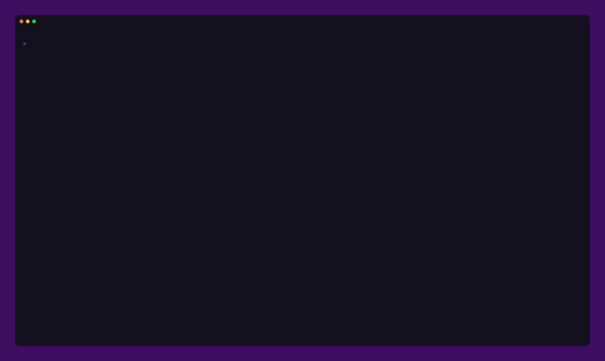
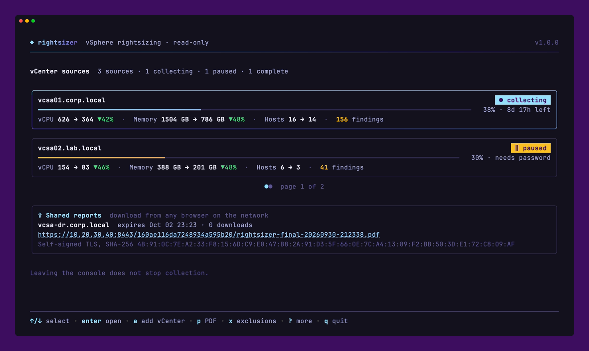
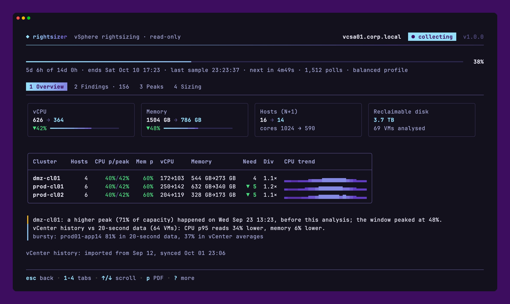
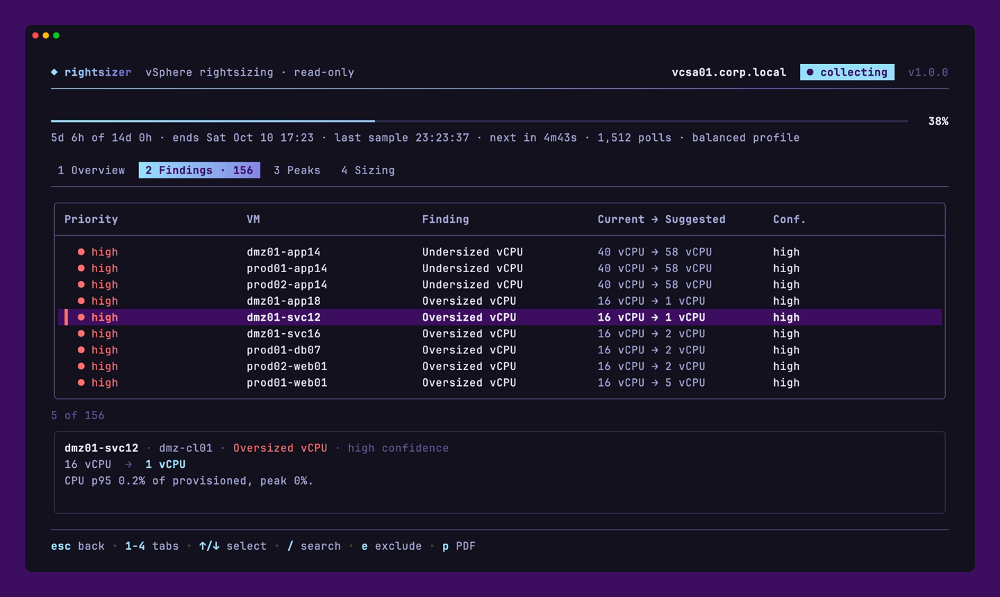
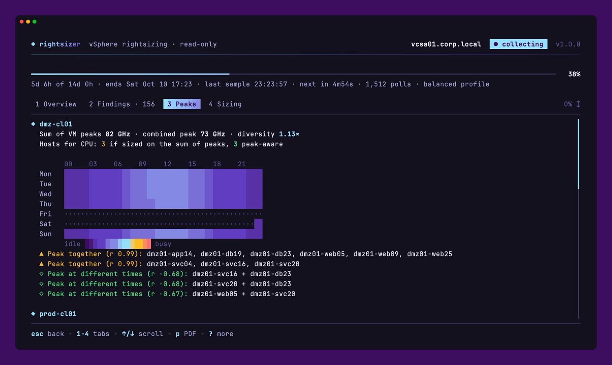
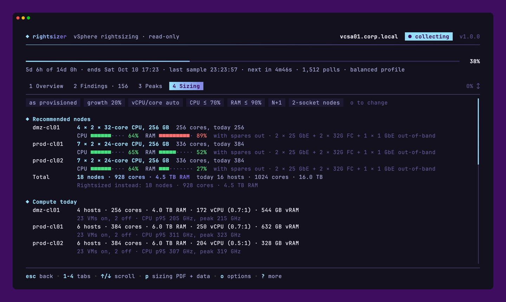
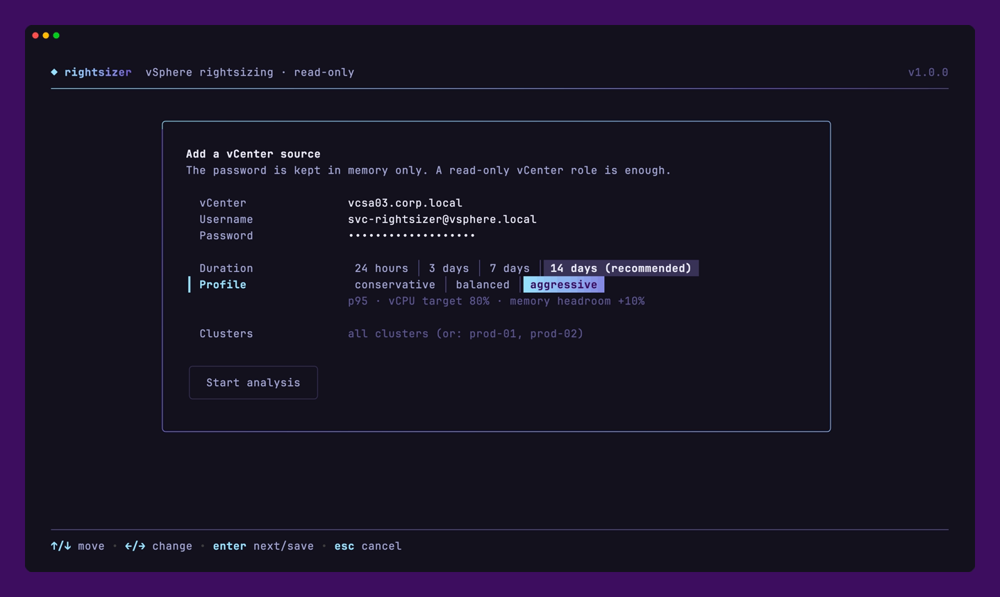
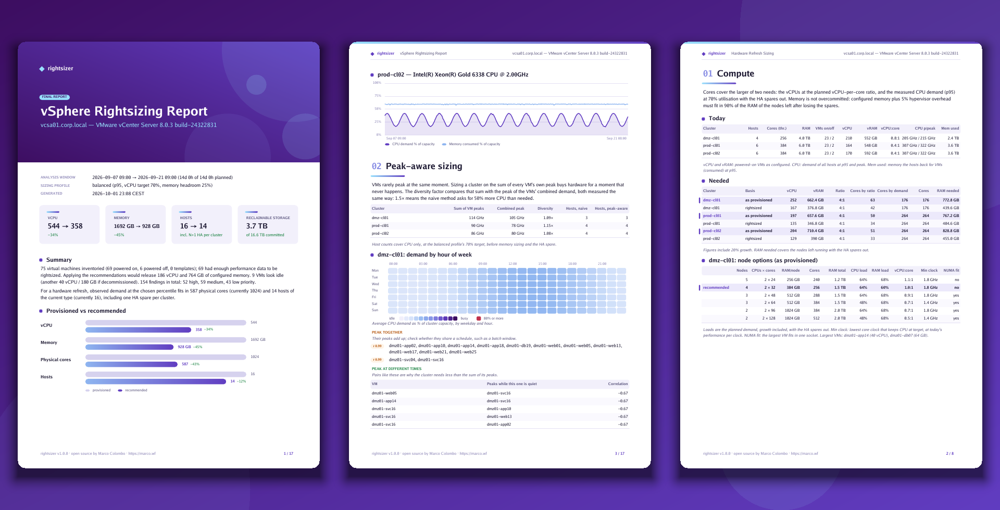

<div align="center">

# rightsizer

**Size your next hardware refresh on what your VMs use, not on what they were given.**

[](https://github.com/MarcoColomb0/rightsizer/actions/workflows/ci.yml)
[](https://github.com/MarcoColomb0/rightsizer/releases/latest)
[](LICENSE)



</div>

rightsizer watches your VMware vCenters for 24 hours to 14 days, compares what every VM was given with what it really uses, and tells you what the environment needs: smaller VMs, fewer hosts, and the nodes, ports and storage to buy for a refresh. It only reads from vCenter and never changes anything.

- **Rightsizing:** oversized and undersized vCPU and memory for every VM, each with a confidence level.
- **Hardware refresh sizing:** node shapes and counts per cluster, network and FC ports, and raw storage with IOPS and throughput.
- **Peak-aware:** how much less CPU a cluster needs than the sum of its VMs' peaks, with an hour-of-week heatmap.
- **Results on day one:** 14 days of vCenter history are imported at the start, then each VM moves to 20-second data.
- **Hidden waste:** orphaned disks, idle and powered-off VMs, old snapshots, NUMA-wide VMs and co-stop.
- **Reports:** PDF reports and CSV data for every vCenter, or one for all of them.

## Showcase

**Every vCenter on one screen**



**Totals, clusters and CPU trends**



**Findings with vim-style search**



**When each cluster is busy**



**Hardware refresh sizing**



**Adding a vCenter**



**PDF reports**



## Try it

The console runs on synthetic vCenters, with nothing to install or connect:

```bash
docker run --rm -it -e TERM -e COLORTERM ghcr.io/marcocolomb0/rightsizer demo
```

## Install

**Appliance:** deploy `rightsizer-vX.Y.Z.ova` from the [latest release](https://github.com/MarcoColomb0/rightsizer/releases/latest) with **Deploy OVF Template**, set the administrator password and network, power it on, then:

```bash
ssh admin@<appliance-address>
```

**Docker on Linux:**

```bash
curl -fsSL https://raw.githubusercontent.com/MarcoColomb0/rightsizer/main/install.sh | sudo bash
rightsizer
```

Requirements, options and upgrades are in [docs/install.md](docs/install.md).

## Use

1. Press `a` and enter a vCenter, a user with the built-in **Read-only** role, the duration and a sizing profile.
2. Check the certificate fingerprint against vCenter and press `y`.
3. Leave with `q`: collection continues in the background. Come back to follow it, open the findings and build reports with `p`.

`?` lists the keys on every screen, and the mouse works too. See [docs/console.md](docs/console.md).

## Security

rightsizer only reads: every vSphere call passes an allowlist of read methods before it leaves the process. vCenter certificates are pinned, stored credentials are encrypted with a key derived from the administrator password and held only in memory, and the appliance is a hardened, immutable [Flatcar](https://www.flatcar.org) host. Details are in [docs/security.md](docs/security.md); please report vulnerabilities through [GitHub security advisories](https://github.com/MarcoColomb0/rightsizer/security/advisories/new).

## Documentation

- [Install and upgrade](docs/install.md)
- [Using the console](docs/console.md)
- [How recommendations and sizing are calculated](docs/how-it-works.md)
- [Security](docs/security.md)

## Development

```bash
make test       # unit tests and integration tests against the govmomi vCenter simulator
make lint       # golangci-lint
make demo       # build and open the console on synthetic vCenters
make demo-pdf   # sample reports: demo.pdf and demo-sizing.pdf
make image      # container image rightsizer:local
```

`appliance/smoke-test.sh` boots the appliance in QEMU and `appliance/build.sh` builds the OVA. `vhs docs/demo.tape` records the showcase.

## License

[Apache License 2.0](LICENSE) © [Marco Colombo](https://marco.wf)
